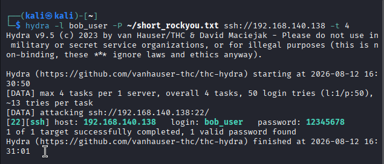
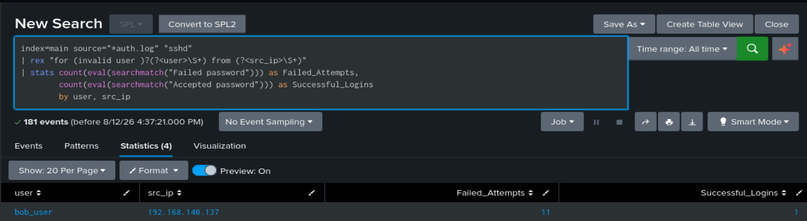

#  Splunk SIEM: SSH Brute Force Attack Detection & Incident Analysis

##  Executive Summary
This project demonstrates an end-to-end SOC SIEM lab setup using **Splunk Enterprise** deployed in a Docker container on Kali Linux. The lab simulates an SSH Brute Force attack using **Hydra**, captures authentication logs (`auth.log`), and utilizes custom **SPL (Splunk Processing Language)** queries with Regular Expressions (`rex`) to detect, extract, and analyze attack metrics.

---

##  Lab Architecture & Setup
* **Target Host:** Kali Linux (Splunk Enterprise in Docker) - `192.168.140.138`
* **Attacker Host:** External Kali Live VM - `192.168.140.137`
* **SIEM Platform:** Splunk Enterprise (Docker Container)
* **Attack Vector:** SSH Service (`port 22`)
* **Attack Tool:** Hydra (`rockyou.txt` wordlist)
* **Data Source:** `/var/log/auth.log` (Linux Authentication Logs)

---

##  Attack Simulation (Hydra)
A targeted SSH dictionary attack was launched from an external Kali Live virtual machine against user `bob_user` using the `rockyou.txt` wordlist:
> **Note:** To optimize lab execution time and avoid processing the full 14-million-word list, a truncated version (`short_rockyou.txt`) containing the first 50 entries was generated using `head -n 50 /usr/share/wordlists/rockyou.txt > ~/short_rockyou.txt`.



```bash
hydra -l bob_user -P /usr/share/wordlists/rockyou.txt ssh://192.168.140.138 -t 4

```
The attack generated multiple failed authentication attempts followed by a successful login once the correct credentials were identified.

---

## SPL Detection Query
To isolate the attack pattern and perform field extraction on raw logs in real time, the following SPL query was constructed:

```spl
index=main source="*auth.log" "sshd"
| rex "for (invalid user )?(?<user>\S+) from (?<src_ip>\S+)"
| stats count(eval(searchmatch("Failed password"))) as Failed_Attempts, 
        count(eval(searchmatch("Accepted password"))) as Successful_Logins 
        by user, src_ip
```

Query Breakdown:

* ```index=main source="*auth.log" "sshd" ```: Filters raw logs specifically for SSH daemon activity.
* ```rex```: Uses regular expressions to extract dynamic fields (user and src_ip) directly from unparsed log strings.
* ```stats count(eval(...))```: Aggregates and correlates failed login attempts alongside successful breaches per source IP and targeted username.

---

## Investigation Results
The investigation confirmed a high-severity incident: **multiple failed login attempts** generated by a dictionary attack (`rockyou.txt`), followed by a **successful credential breach** targeting user `bob_user` originating from the remote attacker IP (`192.168.140.137`).



---

##  Incident Response & Mitigation Playbook
When an alert of this nature triggers in a live SOC environment, the following remediation steps are recommended:

* **Source Isolation:** Immediately block the attacker's source IP address (`192.168.140.137`) at the perimeter firewall / Network Security Group.
* **Account Remediation:** Force an immediate password reset for the compromised account (`bob_user`) and terminate active SSH sessions.
* **Post-Exploitation Auditing:** Audit `/var/log/auth.log` and bash shell history (`~bob_user/.bash_history`) for unauthorized post-breach commands or privilege escalation (`sudo`) attempts.


